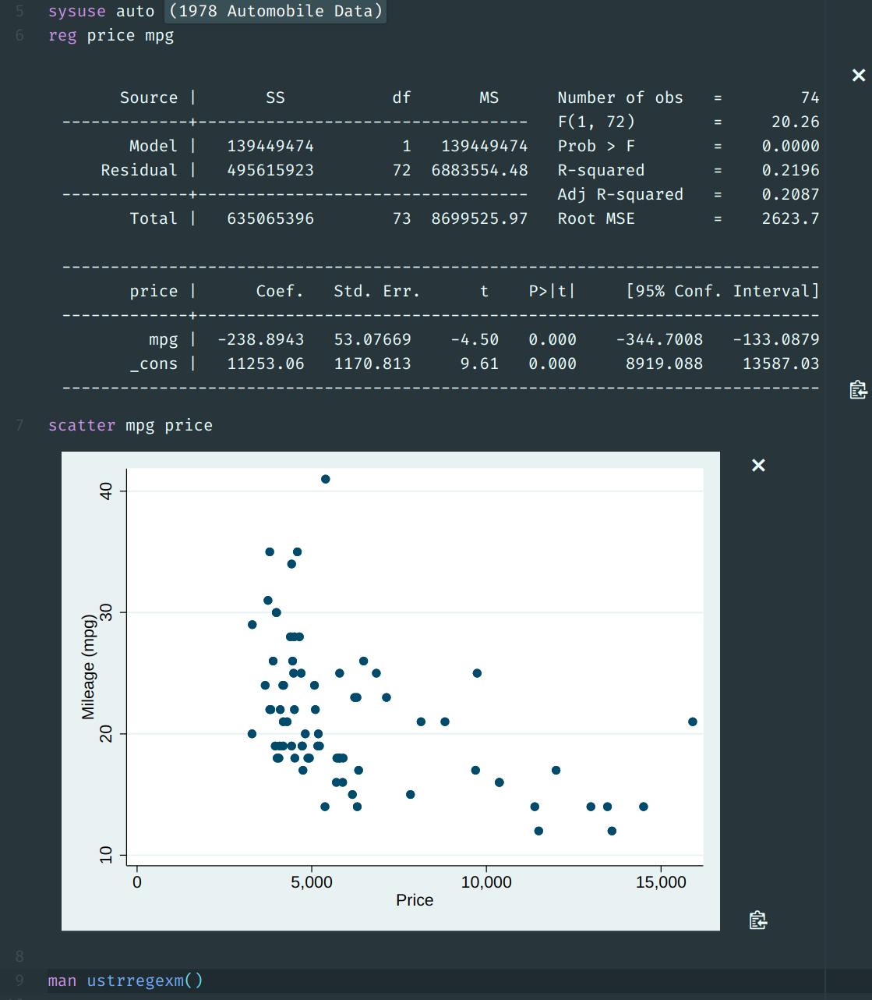
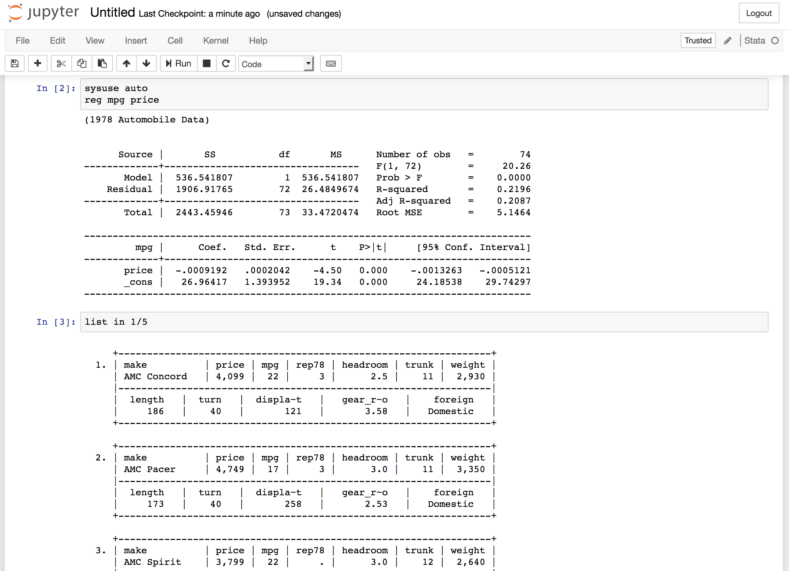

# stata_kernel

`stata_kernel` is a Jupyter kernel for Stata; It works on Windows, macOS, and
Linux.

Atom             |  Jupyter Notebook
:-------------------------:|:-------------------------:
    |  


### Comparison with [ipystata](https://github.com/TiesdeKok/ipystata)

Except for Windows, this package takes a different approach to communication
with Stata. On macOS and Linux, this controls the Stata console directly, which
prevents speed degradation with larger data sets. In contrast, `ipystata` saves
the data set to disk after each code cell, slowing execution.

This is also a pure Jupyter kernel, whereas `ipystata` is a Jupyter "magic" within the Python kernel. This means that you don't need to have any knowledge of Python* and don't need to have packages like Pandas installed.

\* Python is amazing language, and if you want to move on to bigger data, I highly recommend learning Python.

## Installation

### Prerequisites

- **Python**. In order to install the kernel, Python >= 3.5 needs to be installed. I suggest installing the [Anaconda distribution](https://www.anaconda.com/download/), which doesn't require administrator privileges and is simple to install. If you want to use less disk space, install [Miniconda](https://conda.io/miniconda.html), which includes few packages other than Python.
- **Windows only:**
    - Install [pywin32](https://github.com/mhammond/pywin32/releases/tag/latest), which lets Python talk to Stata. Choose the `.exe` file that matches the version of Python you have installed and 64/32-bit nature of your computer. If you have a 64-bit computer and have Python 3.6 installed, you would download and run the file:

        ```
        pywin32-{release number}.win-amd64-py3.6.exe
        ```
    - [Link the Stata Automation library](https://www.stata.com/automation/#install). The Stata executable is most likely in the folder `C:\Program Files (x86)\Stata15`.

        1. In the installation directory, right-click on the Stata executable, for example, StataSE.exe. Choose "Create Shortcut".
        2. Right-click on the newly created "Shortcut to StataSE.exe", choose "Property", and change the Target from "C:\Program Files\Stata13\StataSE.exe" to "C:\Program Files\Stata13\StataSE.exe" /Register. Click "OK".
        3. Right-click on the updated "Shortcut to StataSE.exe"; choose "Run as administrator"

### Package Install

To install the kernel, run:

```
$ pip install git+https://github.com/kylebarron/stata_kernel
$ python -m stata_kernel.install
```

If the `pip install` step gives you an error like "DEPRECATION: Uninstalling a distutils installed project (pexpect) has been deprecated", try
```
$ pip install git+https://github.com/kylebarron/stata_kernel --ignore-install pexpect
```

## Configuration

The configuration file is named `.stata_kernel.conf` and is located in your home directory. You need to set the path to your Stata executable before running the kernel.

- `stata_path`: The path to your Stata executable.

    On Mac, the default installation is in a place like
    ```
    /Applications/Stata/StataSE.app/Contents/MacOS/
    ```

    There are two executables: `StataSE` and `stata-se`. The former opens the GUI
    and should be used if you choose `automation` mode, while the latter opens the
    console and should be used if you choose `console` mode.

- `execution_mode`: This can be set to `automation` or `console`, and is the manner in which this kernel talks to Stata. `automation` uses Stata Automation to communicate to Stata while `console` controls the console version of Stata. `automation` is only available on Windows or macOS. `console` is only available on macOS or Linux. On macOS, `automation` is the preferred option, though may have more bugs at the moment than `console`.

## Using the Stata kernel

The main ways to use this are through Jupyter notebook, Atom, or an enhanced console.

### Jupyter Notebook

You can start the Jupyter Notebook server by running `jupyter notebook` in your terminal or command prompt. The *New* menu in the notebook should show an option for a Stata notebook.

### Atom

Download the [Atom text editor](https://atom.io) and install the [Hydrogen package](https://atom.io/packages/hydrogen), and [language-stata](https://atom.io/packages/language-stata) syntax highlighting package.

Open a `.do` file and run <kbd>Ctrl</kbd>-<kbd>Enter</kbd> to start the Stata kernel.

### Console

To use it as a console, run:
```
$ jupyter console --kernel stata
```

Example:


<!-- ## Troubleshooting -->

## Limitations

- If you make multiple graphs within the same block of code, you need to give them different names with the `name()` argument, or only one will show up.
- Currently can only make one image per minute on Windows/Mac unless you give different names for each graph with `name()`. This will be fixed soon.

## To do

- [ ] Support autocompletions based on the variables, macros, and return objects currently in memory.
- [ ] Improve syntax highlighting
