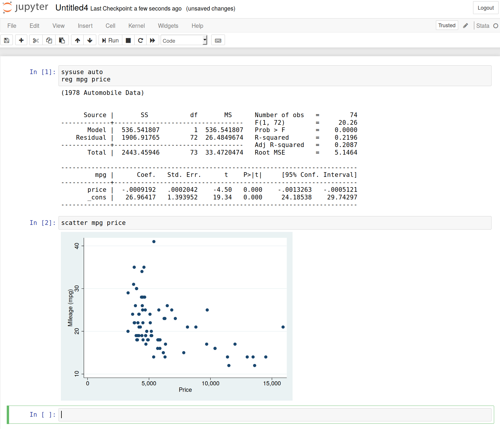

# stata_kernel

`stata_kernel` is a Jupyter kernel for Stata; It works on Windows, macOS, and
Linux.

For documentation and more information, see: [https://kylebarron.github.io/stata_kernel](https://kylebarron.github.io/stata_kernel)

Atom             |  Jupyter Notebook
:-------------------------:|:-------------------------:
    |  
