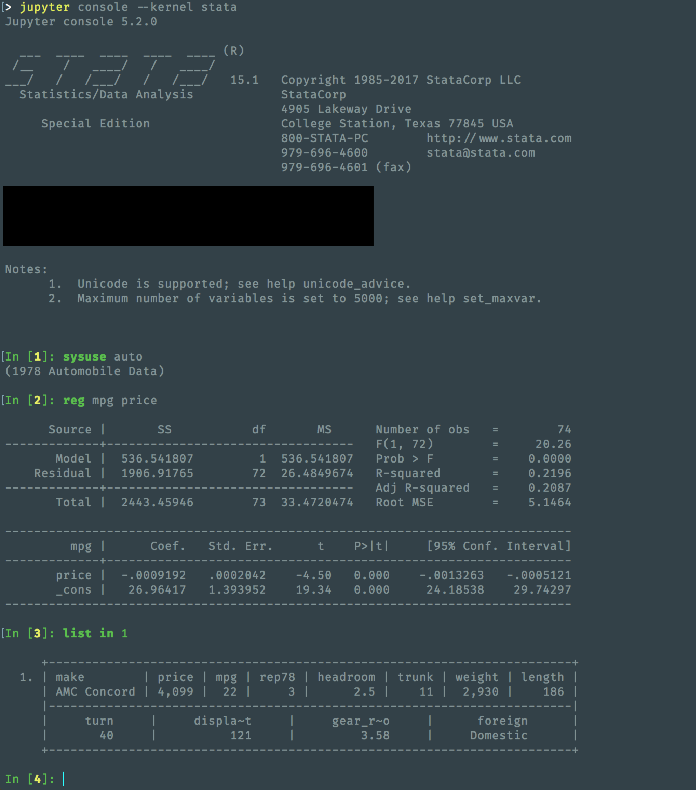

# stata_kernel

`stata_kernel` is a Jupyter kernel for Stata.

## Installation

To install, run:

```
$ pip install git+https://github.com/kylebarron/stata_kernel
$ python -m stata_kernel.install
```

## Configuration

The only configuration necessary is setting the path to your Stata executable.
Open the file `.stata_kernel.conf` in your home directory and set the value of
`stata_path` to the correct path.

## Using the Stata kernel

**Notebook**: The *New* menu in the notebook should show an option for an Stata notebook.

**Console frontends**: To use it as a console, type:
```
$ jupyter console --kernel stata
```

## Troubleshooting

If you're having trouble connecting to the kernel, try typing `set more off,
permanently` into a different instance of Stata on the same machine and for the
same user. It seems the program has some issues dealing with `--more--`.

## Examples



