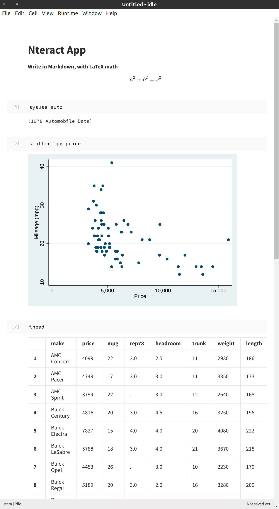

# Nteract

Nteract is a desktop-based computing environment to work with Jupyter Notebook files. It can load and save Jupyter Notebook files and export to PDFs, including output.

You can download the software from <https://nteract.io>.

(It's helpful to know that you can use <kbd>Ctrl</kbd>+<kbd>Space</kbd> to trigger autocompletions in Nteract.)

Below is an example screenshot of using Nteract, followed by its PDF output.

<embed src="https://drive.google.com/viewerng/
viewer?embedded=true&url=https://raw.githubusercontent.com/kylebarron/stata_kernel/master/docs/src/img/nteract.pdf" width="100%" height="800px">
