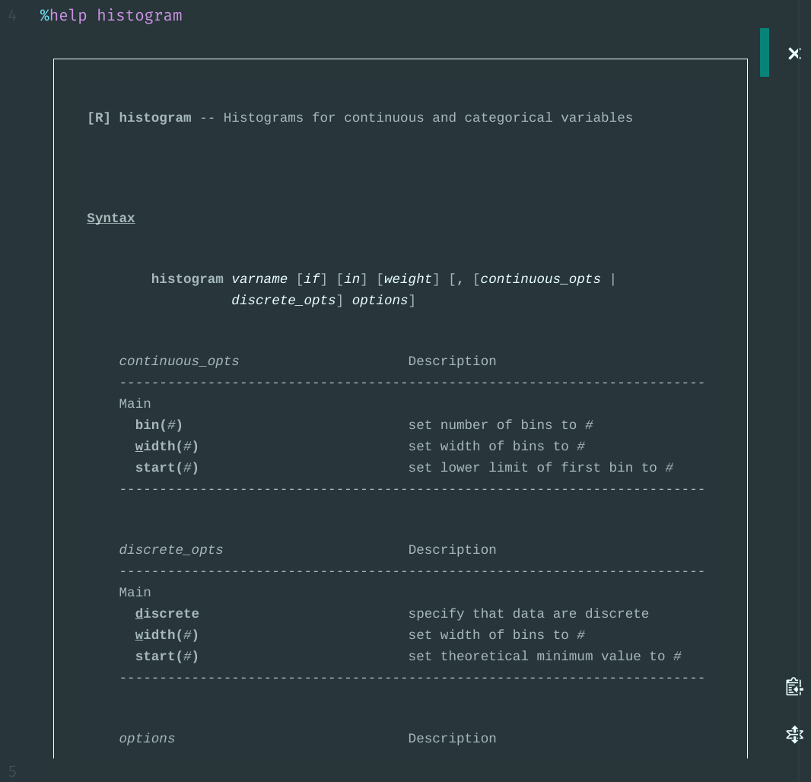

# Magics

**Magics** are programs provided by `stata_kernel` that enhance the experience
of working with Stata in Jupyter.

All magics are special commands that start with `%`. They must be the first word
of the cell or selection, otherwise they won't be intercepted and will be sent
to Stata.

For most of the magics listed, you can add `--help` to see a help menu in the kernel. For example,
```
In [1]: %locals --help
usage: %locals [-h] [-v] [REGEX [REGEX ...]]

positional arguments:
  REGEX          regex to match

optional arguments:
  -h, --help     show this help message and exit
  -v, --verbose  Verbose output (print full contents of matched locals).
```

The magics that respond with richly formatted text, namely `%browse` and
`%help`, will not work with Jupyter Console or Jupyter QtConsole, since they
don't support displaying HTML.

## `%browse`

**Interactively view your dataset**

For now, this displays the first 200 rows of your data. This will be expanded in the future to allow for a `varlist`, `if`, and `in` options.

|                      |                                                 |
|:--------------------:|:-----------------------------------------------:|
|       **Atom**       |                  |
| **Jupyter Notebook** |  |

## `%delimit`

**Print the current delimiter**

This takes no arguments; it prints the delimiter currently set: either `cr` or
`;`. If you want to change the delimiter, use `#delimit ;` or `#delimit cr`. The
delimiter will remain set until changed.

```
In [1]: %delimit
The delimiter is currently: cr

In [2]: #delimit ;
delimiter now ;
In [3]: %delimit
The delimiter is currently: ;

In [4]: #delimit cr
delimiter now cr
```

## `%head`, `%tail`

**View the first or last observations of the data**

This can optionally be provided with a `varlist`, `N`, or `if`:
```
%head [-h] [N] [varlist] [if]
%tail [-h] [N] [varlist] [if]
```

For example,
```
sysuse auto
%head 5 make price mpg if mpg < 20
```

## `%help`

**Display a help file in rich text**

```
%help [-h] command_or_topic_name
```

Add the term you want to search for after `%help`:
```
In [1]: %help histogram
```

The terms in italics (Atom) or underlined (Jupyter Notebook) are _links_. Click
on them to see another help menu.


|                      |                                                 |
|:--------------------:|:-----------------------------------------------:|
|       **Atom**       |                  |
| **Jupyter Notebook** |  |


## `%locals`, `%globals`

**List local or global macros**

```
%locals [-h] [-v] [REGEX [REGEX ...]]
%globals [-h] [-v] [REGEX [REGEX ...]]
```

These take two optional arguments:

1. a regular expression for filtering the locals or globals displayed
2. a `--verbose` flag

```
In [1]: %globals S_
(note: showing first line of global values; run with --verbose)

S_ADO:     BASE;SITE;.;PERSONAL;PLUS;OLDPLACE;`"/home/kyle/github/stata/sta
S_level:   95
S_CONSOLE: console
S_FLAVOR:  Intercooled
S_OS:      Unix
S_MACH:    PC (64-bit x86-64)

In [2]: %globals S_ --verbose
S_ADO:     BASE;SITE;.;PERSONAL;PLUS;OLDPLACE;`"/home/kyle/github/stata/sta
           > ta_kernel/stata_kernel/ado"'
S_level:   95
S_CONSOLE: console
S_FLAVOR:  Intercooled
S_OS:      Unix
S_MACH:    PC (64-bit x86-64)
```


## `%set`

**Set configuration value**

Usage:
```
%set [-h] [--permanently] [--reset] key value
```

- `key`: Configuration key name. The full list of configuration options is shown on the [Getting Started](../getting_started.md#configuration) page.
- `value`: Value to set.
- `--permanently`: Store settings permanently.
- `--reset`: Restore default settings.

As an example, you can change the graph settings like so:

```
%set graph_format svg --permanently
%set graph_scale 1
%set graph_width 500
%set graph_height 300
```

<!-- ## `%time`

**Time Execution of a Command**

This timing is currently most exact on macOS and Linux using the console method of speaking to Stata. It may be redeveloped in the future to use Stata's `rmsg` option.

```stata
%time sleep 100
``` -->
